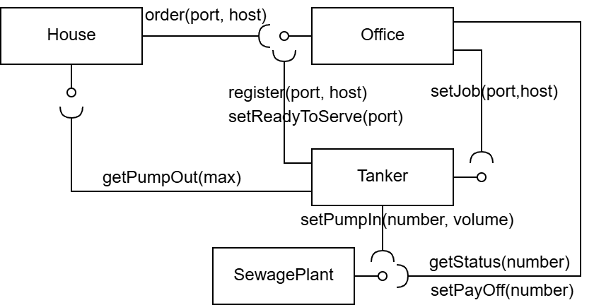

# Zadanie laboratoryjne: System wywożenia nieczystości

Podczas laboratorium należy zbudować aplikację działającą w środowisku rozproszonym, wykorzystującą do komunikacji gniazda TCP/IP obsługiwane za pomocą klas ServerSocket oraz Socket. Dokładniej - należy zaimplementować mały system, w którego skład wejdą podsystemy uruchamiane równolegle (na jednym lub na kilku różnych komputerach). Zakładamy, że system będzie pełnił rolę symulatora systemu wywożenia nieczystości z przydomowych szamb. W systemie tym zachodzić będą interakcje między następującymi podsystemami:

## Podsystemy

* **Dom (House)**
    * to osobna aplikacja, parametryzowana własnym portem oraz pojemnością szamba.
    * reprezentuje dom jednorodzinny, który nie jest podłączony do sieci kanalizacyjnej. Zużywana w nim woda i wytwarzane nieczystości gromadzone są w przydomowym szambie. Co jakiś czas przydomowe szambo musi być opróżnione. Dom wysyła zamówienie na taką usługę do Biura, gdy szambo wypełni się do poziomu alarmowego. Realizacją zamówionej usługi bezpośrednio Cysterna.
    * na własnym porcie wystawia interfejs `IHouse` z metodą:
        * `int getPumpOut(int max)` - metoda pozwala opróżnić przydomowe szambo, jej parametrem jest dostępna pojemność cysterny, wartością zwracaną zaś objętość rzeczywiście wypompowanych nieczystości;
    * korzysta z interfejsu Biura, by wysłać zamówienie na usługę opróżnienia szamba.

* **Biuro (Office)**
    * to osobna aplikacja, parametryzowana własnym portem oraz portem i hostem Oczyszczalni;
    * reprezentuje biuro firmy świadczącej usługi wywozu nieczystości, które przyjmuje zamówienie na usługi od Domów oraz zleca ich wykonanie Cysternom;
    * na własnym porcie wystawia interfejs `IOffice` z metodami:
        * `int register(string port, string host)` - metoda pozwalająca Cysternie zarejestrować się w Biurze, jej parametrami są dane hosta i portu, na którym działa Cysterna. Wartością zwracaną jest przyznany numer Cysterny;
        * `int order(string port, string host)` - metoda pozwalająca Domowi zamówić wywóz nieczystości, jej parametrami są dane hosta i portu, na którym działa Dom. Wartością zwracaną jest wartość oznaczająca przyjęcie (1) lub odrzucenie (0) zamówienia na usługę;
        * `void setReadyToServe(int number)` - metoda pozwalająca Cysternie zgłosić gotowość przyjęcia zlecenia;
    * korzysta z interfejsu Cysterny, by wysłać zlecenie wykonania usługi;
    * korzysta z interfejsu Oczyszczalni, by pozyskać informację o sumarycznej objętości przywiezionych tam nieczystości przez poszczególne Cysterny oraz rozliczyć się za te przywiezione nieczystości z Oczyszczalnią;

* **Cysterna (Tanker)**
    * to osobna aplikacja, parametryzowana własną maksymalną pojemnością, własnym portem oraz portem i hostem Biura, portem i hostem Oczyszczalni;
    * reprezentuje cysternę, która rejestruje się w Biurze i zgłasza do niego gotowość przyjęcia zlecenia, przyjmuje zlecenia wykonania usługi od Biura, wypompowuje nieczystości z szamba przy Domu w ramach wykonywania usługi, wywozi nieczystości do Oczyszczalni;
    * na własnym porcie wystawia interfejs `ITanker` z metodami:
        * `void setJob(string port, string host)` - metoda, którą Biuro zleca wywóz nieczystości, jej parametrami są dane hosta i portu Domu;
    * korzysta z interfejsu Biura, by się tam zarejestrować oraz zgłaszać gotowość przyjęcia zlecenia;
    * korzysta z interfejsu Oczyszczalni, aby wypompować tam przywiezione nieczystości.

* **Oczyszczalnia (SewagePlant)**
    * to osobna aplikacja, parametryzowana własnym portem;
    * reprezentuje oczyszczalnię, w której Cysterny zostawiają nieczystości i z którą rozlicza się Biuro;
    * na własnym porcie wystawia interfejs `ISewagePlant` z metodami:
        * `void setPumpIn(int number, int volume)` - metoda, którą Cysterna przepompowuje przywiezione nieczystości, jej parametrami są numer Cysterny oraz objętość nieczystości;
        * `int getStatus(int number)` - metoda, którą Biuro może pozyskać informację o sumarycznej objętość przywiezionych, nieopłaconych nieczystości przez daną Cysternę, jej parametrem jest numer Cysterny;
        * `void setPayOff(int number)` - metoda, którą Biuro rozlicza się za przywiezione nieczystości przez daną Cysternę, jej parametrem jest numer Cysterny, po wykonaniu tej metody zeruje się suma objętości przywiezionych nieczystości przez tę Cysternę.

## Protokół komunikacyjny

Komunikacja między elementami systemu ma odbywać się z wykorzystaniem gniazd TCP/IP. Aby odpalić metodę danego interfejsu trzeba wysłać żądanie zakodowane tekstowo w postaci:

```text
digit excluding zero = "1" | "2" | "3" | "4" | "5" | "6" | "7" | "8" | "9" ;
digit                = "0" | digit excluding zero ;
positive integer     = digit excluding zero, { digit } ;

host = positive integer, ".", positive integer, ".", positive integer, ".", positive integer ;

get method      = "gp:", positive integer | "gs:", positive integer ;
set method      = "sr:", positive integer | "sj:", positive integer, "," host | "spi:", positive integer, ",", positive integer | "spo:", positive integer ;
register method = "r:" positive integer, "," host ;
order method    = "o:" positive integer, "," host ;
request = get method | set method | register method | order method ;

response = positive integer;
```
Przykładowy schemat powiązań pomiędzy poszczególnymi elementami systemu pokazano na rysunku poniżej.

Pozostałe szczegóły mają być zgodne z ustaleniami poczynionymi na początku zajęć.